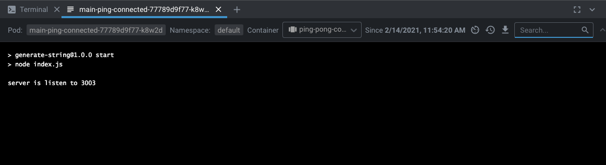
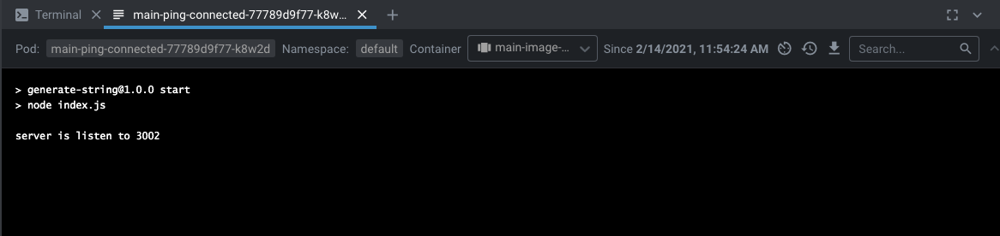
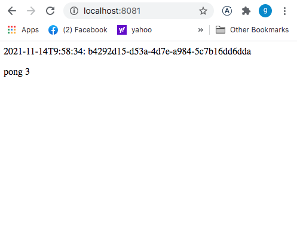

## Commands

`$ kubectl create namespace main-namespace`

`$ kubectl config set-context --current --namespace=main-namespace`

`$ kubectl apply -f manifests/deployment.yml`

`$ kubectl apply -f manifests/service1.yml`

`$ kubectl apply -f manifests/service2.yml`

`$ kubectl apply -f manifests/ingress.yml`

## Main app (shot from Lens)

## Ping-pong microservice (shot from Lens)

## Result in the Browser

