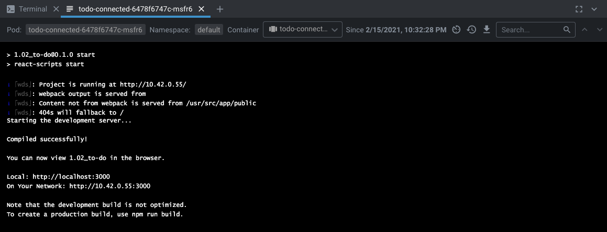
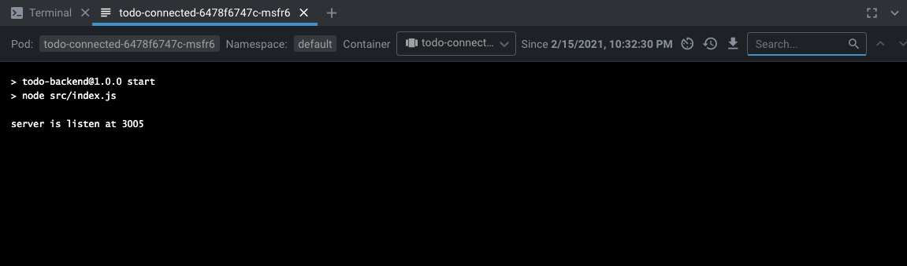
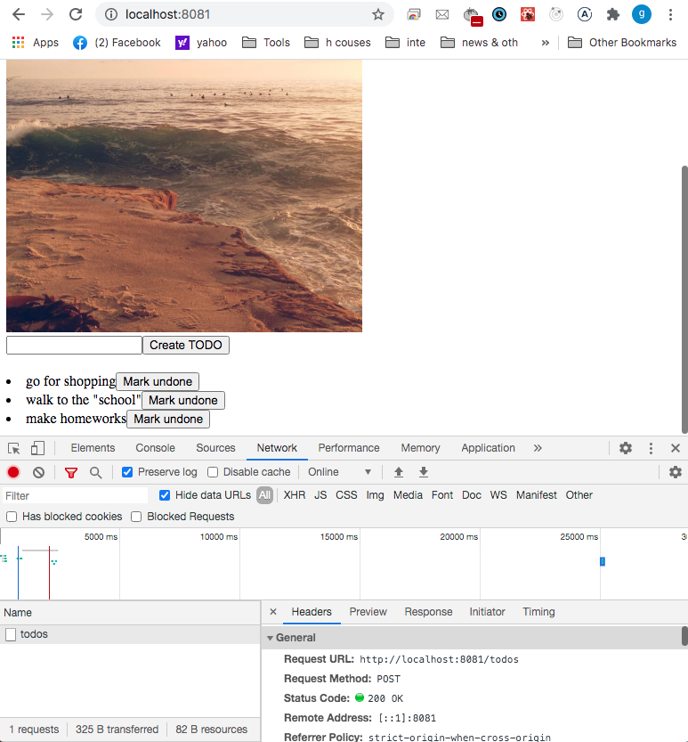

## Commands

`$ kubectl create namespace todo-namespace`

`$ kubectl config set-context --current --namespace=todo-namespace`

`$ kubectl apply -f manifests/deployment.yaml`

`$ kubectl apply -f manifests/service.yaml`

`$ kubectl apply -f manifests/serviceBackend.yaml`

`$ kubectl apply -f manifests/ingress.yaml`

`$ kubectl apply -f manifests/persistentvolume.yaml`

`$ kubectl apply -f manifests/persistentvolumeclaim.yaml`

## To-do React app from (shot from Lens)

## Image fetcher (daily) microservice (shot from Lens)

## Result in the Browser

