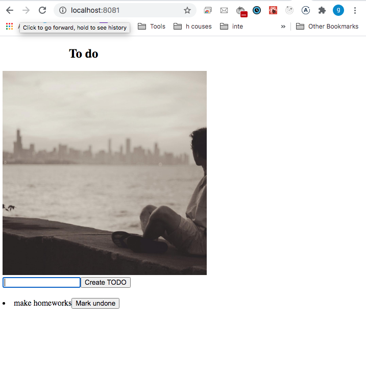
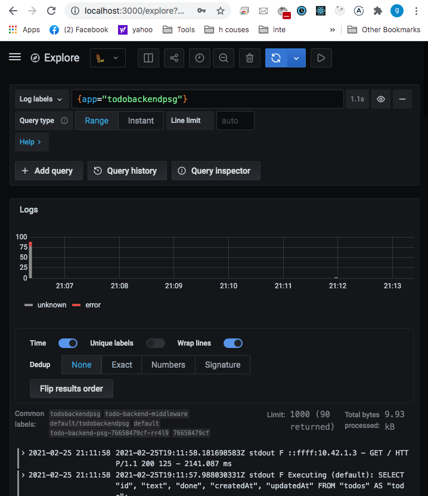
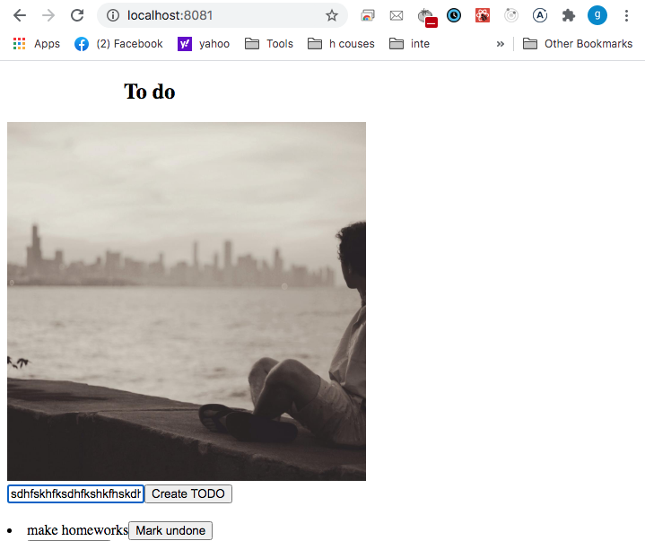
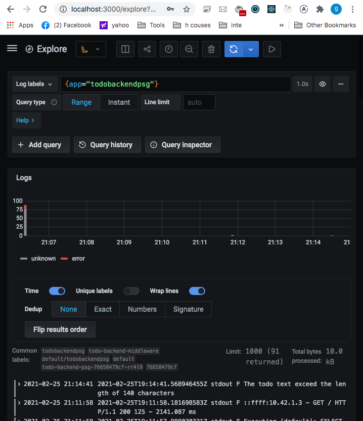

## Todo app: different inputs use cases :
***
* Input an usual text: 'make homeworks':

    
    * Received in  Grafana - Loki
the log: ` - GET / HTTP/1.1 200 123 - 2141.087 ms` : 

    

***

- Input a text that exceed 140 characters:

    

    * Received in  Grafana - Loki the message: "`The todo text exceed the length of 140 characters.`" :

    
***