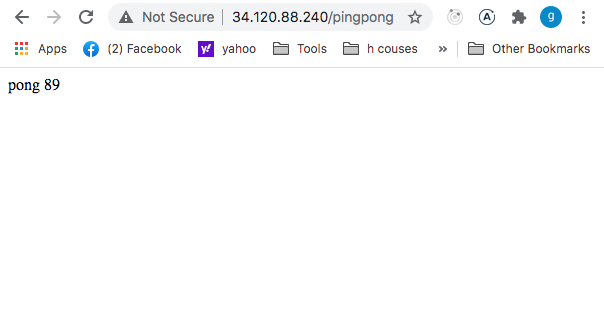
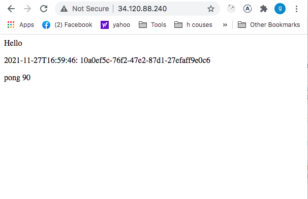
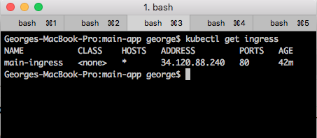
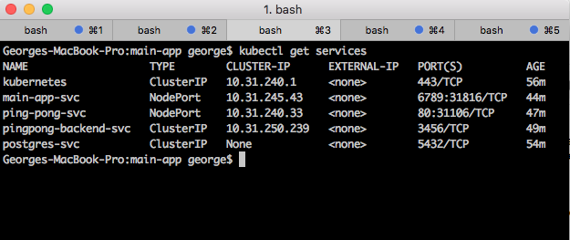
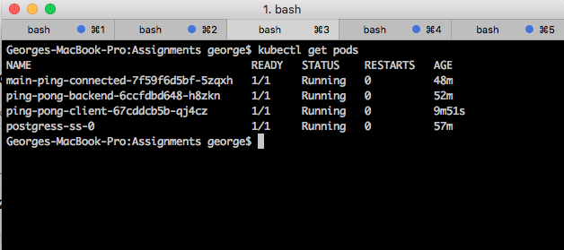
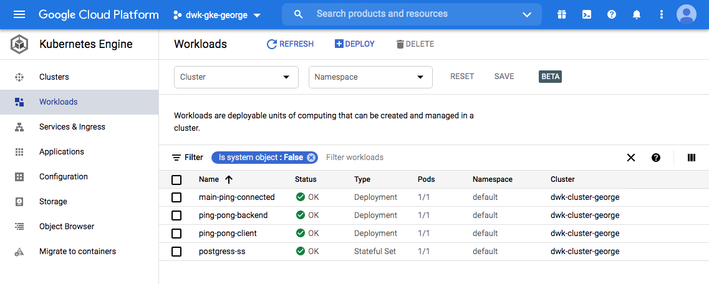
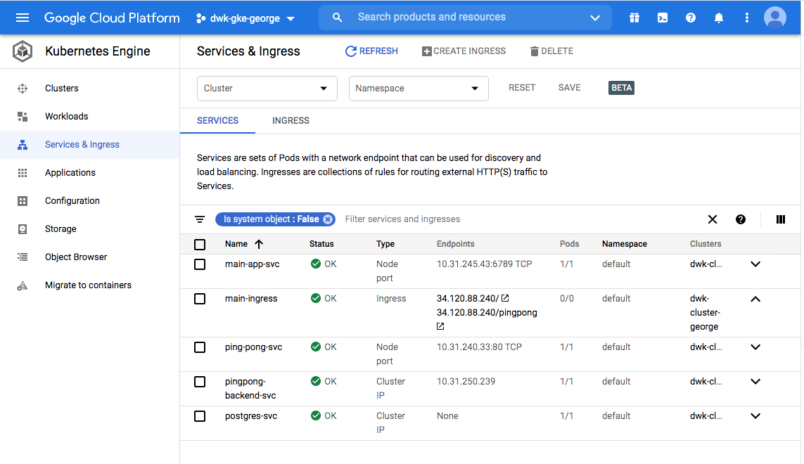

## Deployment to GKE script commands

`$ kubectl apply -f pingpong-backend-postgres/manifest/secret.yaml`

`$ kubectl apply -f pingpong-backend-postgres/manifest/configmaps.yaml`

`$ kubectl apply -f postgres-db/statefulset.yaml`
`$ kubectl apply -f pingpong-backend-postgres/manifest/deployment.yaml`

`$ kubectl apply -f pingpong-backend-postgres/manifest/service.yaml`

`$ kubectl apply -f ping-pong/manifest/configmaps.yaml`

`$ kubectl apply -f ping-pong/manifest/deployment.yaml`

`$ kubectl apply -f ping-pong/manifest/service.yaml`

`$ kubectl apply -f main-app/manifest/configmaps.yaml`

`$ kubectl apply -f main-app/manifest/deployment.yaml`

`$ kubectl apply -f main-app/manifest/services.yaml`

## Request the Ping/pong app to GKE ingress path: */pingping

## Request the Main app to GKE ingress path: */

## Ingress:

## Services:

## Pods:

## Workloads from Google Cloud platform - GKE:

## Services and ingress from Google Cloud platform - GKE:

## Create cluster and resources on GKE

`$ sh deploy-on-gcloud.sh`