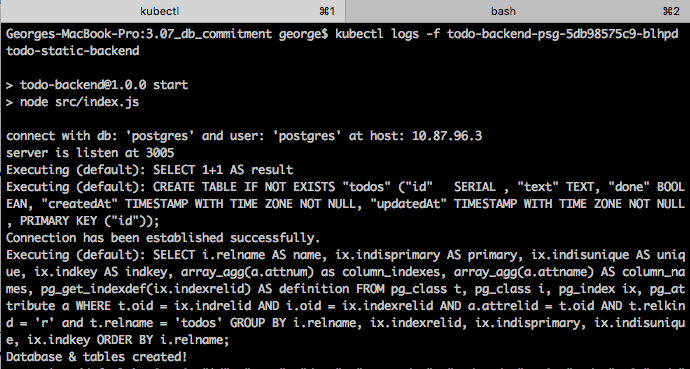
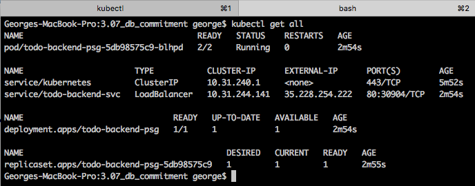
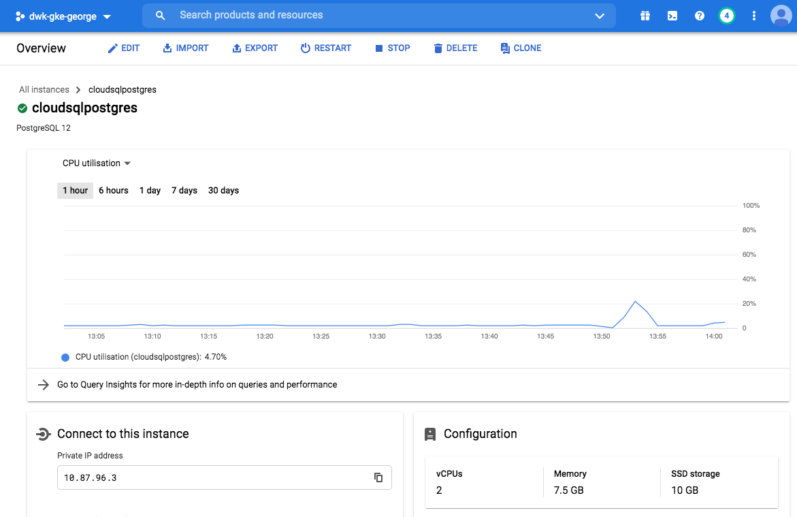

## Choosing Cloud SQL 

### Justification
Google Cloud SQL seems to be a better solution for this small project because it reduce the mundane administrative tasks.
More than that, it have nice features like automate backups and autoscale.

### Browser 

### Logs from connection to Cloud SQL

### Cluster resources

### Cloud SQL from GCP:

