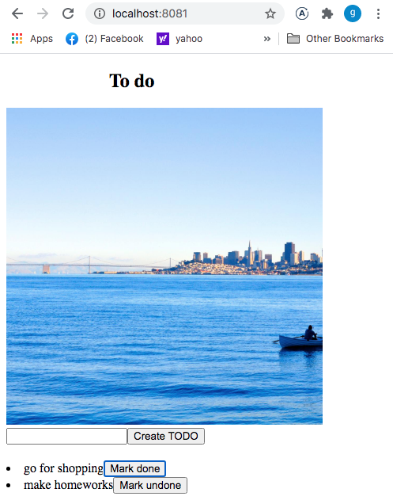

## Query of CPU usage rate (per minute) 

`scalar(sum(rate(container_cpu_usage_seconds_total{namespace="default"}[1m])))`

## Query monitoring before making a new todo

## Query analysis after making a new todo

## Conclusion: 0.15 is a good value as maximum CPU usage refference

## Todo app's rollouts

## Todo app's analysis template

## Browser result

## Files:
* Analysis Template file: `manifests/analysistemplate.yaml`
* Analysis Template file: `manifests/analysistemplate.yaml`
* Rollout file: `manifests/rollout.yaml`

`sh create-resources.sh`