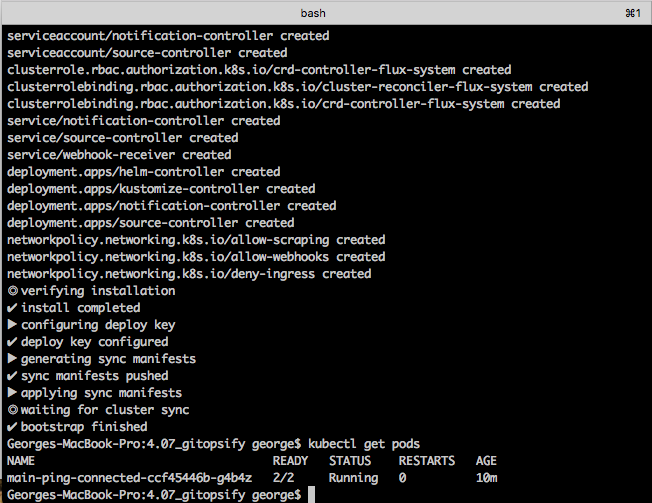
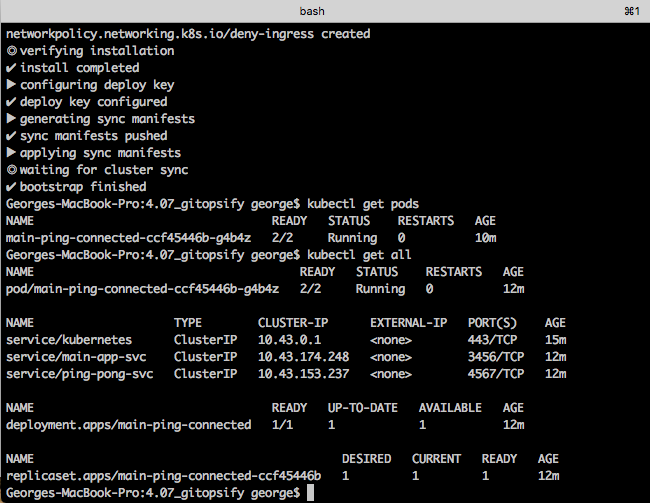

## Commands

`$ flux bootstrap github     --owner=georgemihail     --repository=gitops-main-cluster     --personal     --private=false`

## Environment 
### Repository Configuration
`source.yaml`
### Kustomization Configuration
`gitops-app.yaml`

`for-gitops/manifests/kustomize.yaml`

***
## Sync result and pods

## Resources created

