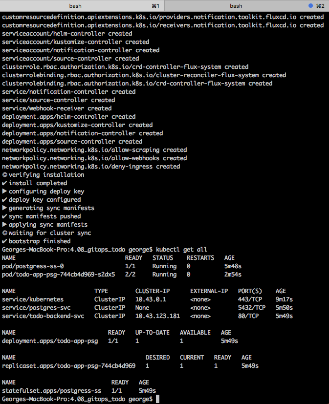
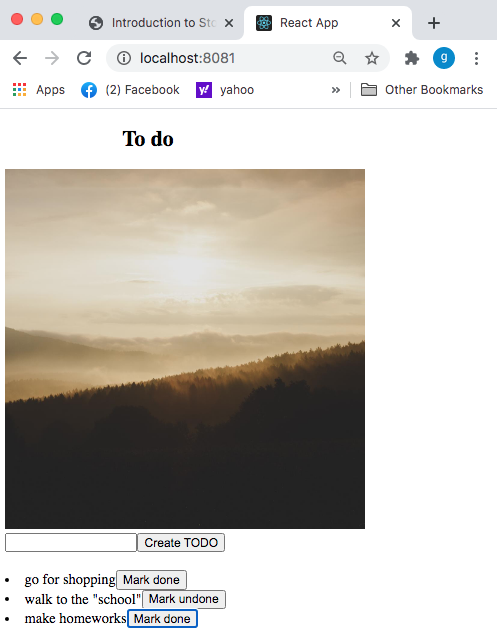
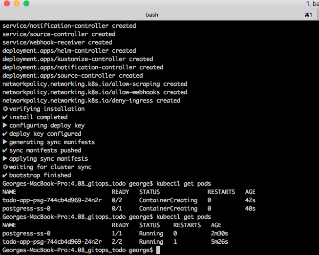

## Resources created

## Browser result

## Sync result and pods

***
## Environment 
### Repository Configuration
`source.yaml`
### Kustomization Configuration
`gitops-app.yaml`

`for-gitops/manifests/kustomize.yaml`

***

## Commands

`$ flux bootstrap github     --owner=georgemihail     --repository=gitops-todo-cluster     --personal --private=false`