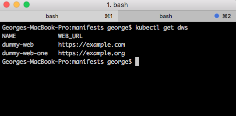
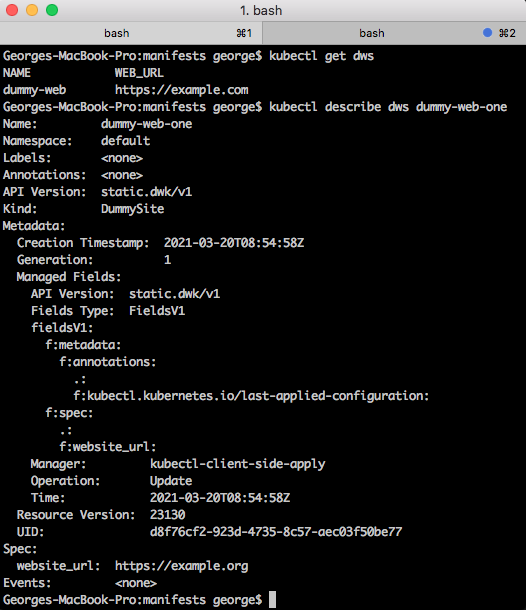
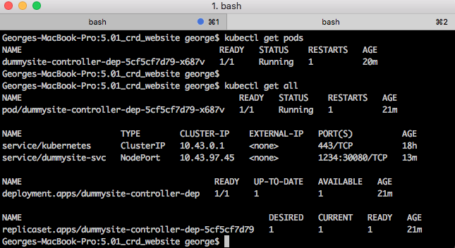
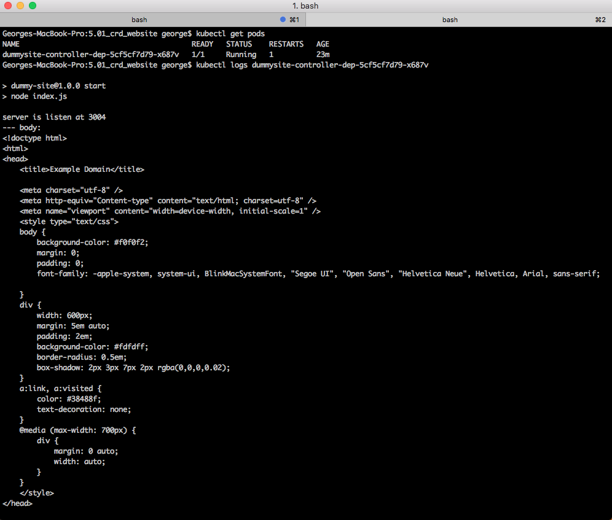
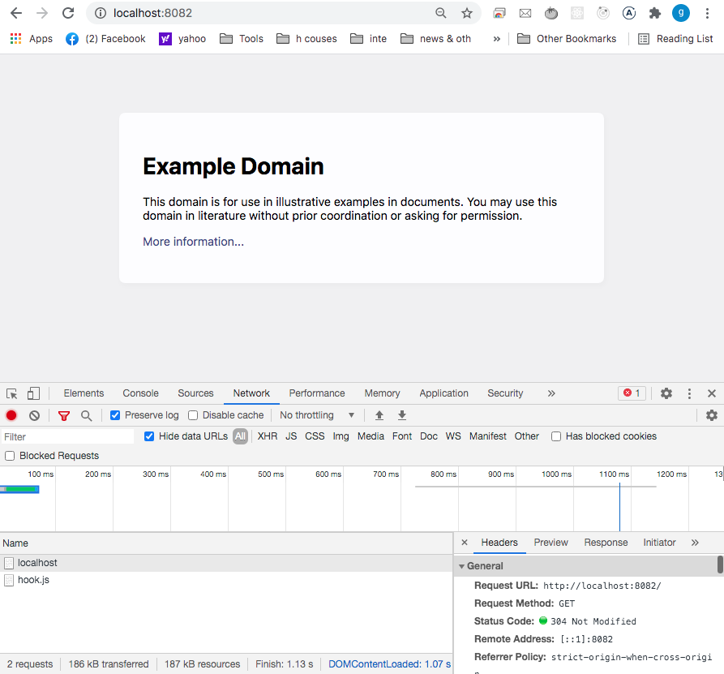

## Custom Resource Definition created

* Below there are 2 DummySite resources which has been created
    * I choosed `dws` as short name for a DummySite resource

    * Also, it has the `website_url` property printed  as `WEB_URL`

## Resource `dummy-web` described

## All resources created in the namespace

## Pod described

## Local browser output

