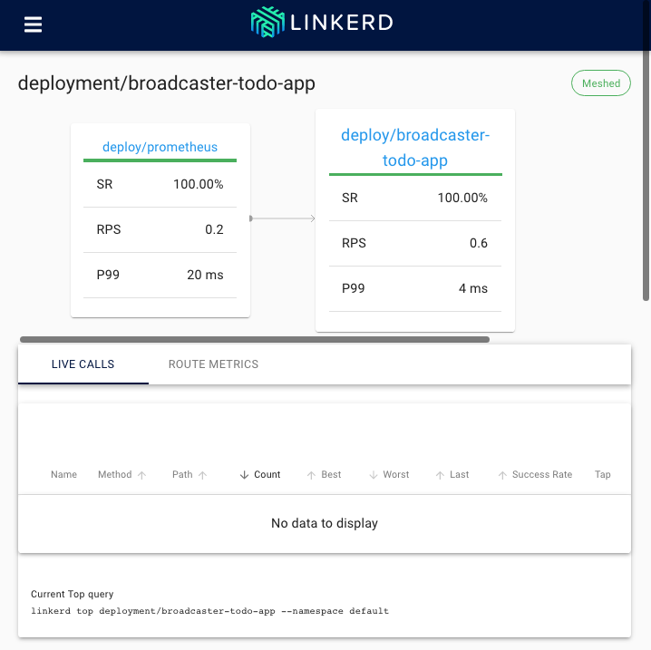
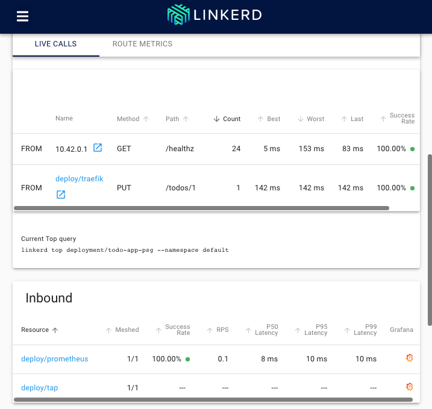
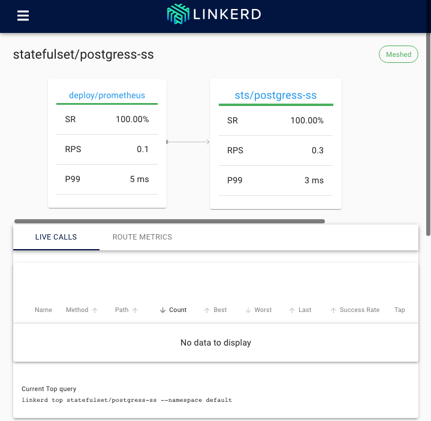
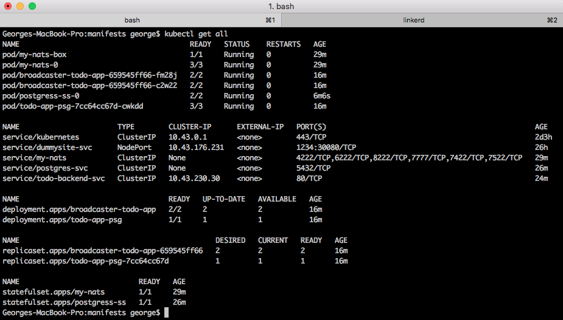

## Modified manifests paths:

Deployment: `manifests/deployment.yaml`

StatefulSet: `manifests/statefulset.yaml`

* Old 'unmeshed' files:

Deployment: `manifests/deployment-old-unmeshed.yaml`

StatefulSet: `manifests/statefulset-old-unmeshed.yaml`

### Deployment broadcaster-todo-app meshed:

### Deployment live calls:

### Postgres StatefulSet meshed:

### All resources in the namespace

